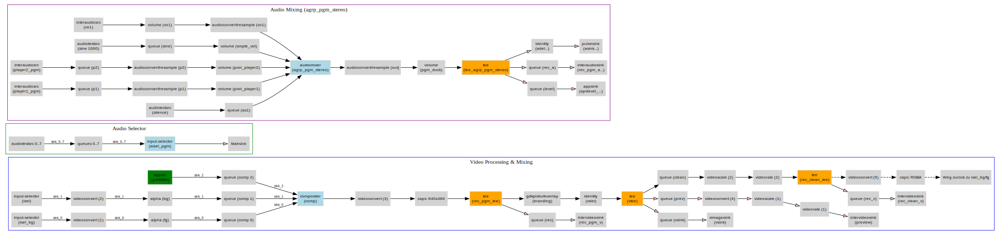

# Pipeline Controller

> Professional GStreamer-based broadcast playout system (channel-in-a-box) for Linux – with an HTML5 web interface, oGraf graphics engine, and plugin system.


---

## 📺 What is Pipeline Controller?

Pipeline Controller is a complete **broadcast playout system** built on the open-source framework **GStreamer**. It enables professional on-air operations through a modern, fully browser-based web interface — designed for 24/7 channel-in-a-box operations.


### Features at a glance

- 🎬 **dynamic configureable amount of independent media players** (MXF, MP4, MOV, TS, …)
- 🎚️ **Master pipeline** with compositor, video switcher, and audio mixing
- 🔊 **Flexible audio routing** with multiple groups, channel matrices, and 5.1 upmix
- 📊 **EBU R128 loudness normalization** per audio group
- ✨ **oGraf HTML5 graphics engine** (EBU standard) via Puppeteer/Chromium with templates
- 📋 **Playlist engine** with transitions (cut, v-fade, cut-fade, fade-cut, X-fade) and event children
- 🧩 **Asset Panel** for one-click commercial breaks with auto-return (interrupt / break / live modes)
- ⏱️ **Counter Strip** showing all time-critical events of the current hour at a glance
- 🎙️ **Voiceover engine** with fade-in/out and program ducking
- 🔌 **Plugin system** running in isolated worker threads (crash-safe playout)
- 🔐 **Optional Bearer-token authentication** with role-based access (admin/editor/grafiker/viewer)
- 🌐 **Full REST API**, SSE event stream, and **HTTPS support**
- 🕐 **PTP clock support** (IEEE 1588 / SMPTE 2110) and DST-safe scheduling
- 🌍 **Bilingual UI** (English / German) with light/dark mode
- 📺 **Multi-channel supervisor** — run several independent channels/playlists per host (e.g. a main channel + a sign-language variant), each with its own data dir/port, with a central dashboard
- 🔗 **ChannelBus cross-channel triggers** — send NEXT/NEXT_LIVE/JUMP/CUT commands between channels (or hosts), including playlist-item-bound trigger children with frame-accurate pre-roll
- 🔲 **DVE / Squeeze** — squeeze the program/live video into a positioned box (or squeeze an image/oGraf overlay over full-screen video), with green-screen auto-detection and chroma-key transparency for frame graphics
- 📤 **Additional outputs** — any number of extra downconverted network outputs (RTMP/SRT/UDP/file) or DeckLink SDI/HDMI hardware sinks, independent of the main program path

---

## 🚀 Quick Start

### Option 1: Installer Package (recommended for production / remote installs)

Native Node.js installation — no AppImage required:

```bash
# On a target machine: download & install
tar -xzf PipelineController-1.0.0.tar.gz
cd PipelineController-1.0.0
bash install.sh          # ⚠️ never with sudo!

# Start
bash ~/pipeline-controller/start.sh
# or as systemd user-service (if enabled during install)
systemctl --user start pipeline-controller
```

The installer verifies Node.js ≥ 18, all required GStreamer plugins (`intervideosrc`, `interaudiosrc`, `compositor`, …), installs missing dependencies via `apt-get`, sets up runtime directories, and configures `settings.json` paths correctly for the target machine.

### Option 2: AppImage

```bash
chmod +x PipelineController-x86_64.AppImage

# IMPORTANT: extract the AppImage (do not run it directly!)
./PipelineController-x86_64.AppImage --appimage-extract
cd squashfs-root
./AppRun
```

> ⚠️ **Important:** The AppImage **must** be extracted — the oGraf graphics engine (Puppeteer/Chromium) requires access to the real filesystem and cannot run from a FUSE-mounted AppImage.

### Option 3: From source

```bash
# Node.js ≥ 18 required
nvm install 20 && nvm use 20

sudo apt install build-essential libgstreamer1.0-dev \
  libgstreamer-plugins-base1.0-dev \
  gstreamer1.0-{tools,plugins-base,plugins-good,plugins-bad,plugins-ugly,libav,x,alsa,gl} \
  pulseaudio

npm install
node server.js
```

Then open in your browser: **http://localhost:3000**

### Option 4: Multi-channel (several playlists on one host)

```bash
node supervisor.js channels.json
```
Opens a dashboard at **http://localhost:3099** listing all configured channels, each running as its own isolated `server.js` process (own port, own data dir). See [Multi-Channel Operation](./HANDBUCH.html#multi-channel) in the manual.

---

## 📋 System Requirements

| Component | Requirement |
|---|---|
| Operating System | Linux x86_64, kernel ≥ 5.4 (Debian 12 / Ubuntu 22.04 recommended) |
| Node.js | ≥ 18 |
| GStreamer | ≥ 1.22 (with `plugins-bad` for `intervideosrc`, `compositor`, …) |
| X11 display | Required for `ximagesink` (use `fakesink` for headless) |
| Audio | PulseAudio (recommended) or ALSA |
| Python 3 | Only required for the Marina Sync plugin |
| RAM | ≥ 2 GB (4 GB recommended) |

---

## 🏗️ Architecture

```
┌─────────────────────────────────────────────────────────────┐
│              Web UI (HTML5 SPA · DE / EN)                   │
└──────────────────────────┬──────────────────────────────────┘
                           │ REST + SSE  (HTTP / HTTPS)
┌──────────────────────────▼──────────────────────────────────┐
│              Node.js Server (server.js)                     │
│  ┌─────────────────────────────────────────────────────┐   │
│  │  Playlist Engine  │ Graphics Engine │  Voiceover    │   │
│  │  Audio Router     │ Plugin Host     │  Media Lib    │   │
│  │  Auth + Roles     │ User Log        │  Asset Engine │   │
│  └─────────────────────────────────────────────────────┘   │
└──────────────────────────┬──────────────────────────────────┘
                           │ gst-kit (native bindings)
┌──────────────────────────▼──────────────────────────────────┐
│  GStreamer Pipelines                                        │
│  ┌──────────┐  ┌──────────┐  ┌──────────┐  ┌────────────┐ │
│  │ Player 1 │  │ Player 2 │  │ Player 3 │→│  Master    │ │
│  └──────────┘  └──────────┘  └──────────┘  │  Pipeline  │ │
│                                              │ (Compositor)│ │
│  ┌──────────────────┐                       │ + Switcher │ │
│  │ oGraf (Chromium) │──────────────────────→│ + AudioMix │ │
│  └──────────────────┘                       └─────┬──────┘ │
└──────────────────────────────────────────────────┼──────────┘
                                                   ▼
                                    Video Sink + Audio Sinks
```

### Master Pipeline (actual GStreamer element graph)

Auto-generated graph of the running master pipeline (compositor, video switcher, audio mixer/router, sinks):



---

## 🎨 oGraf Graphics Engine

Pipeline Controller is built on the **EBU oGraf standard** for HTML5 broadcast graphics. 

### Playlist Variables

Graphics can pull live data from the playlist using a powerful variable syntax — automatically resolved when the graphic appears on screen:

```
{{next[class(movie)]:title}}                  → next movie's title
{{next[title(News)]:starttime|unixms}}        → countdown target as Unix ms
{{current:classifcolor}}                      → dynamic accent color
{{next2[class(movie)]:starttime|HH:MM}}       → 2nd next movie's start time
```

Numeric formats (`unix`, `unixms`, `countdown`, `countdownms`) return real JS numbers — perfect for template fields of type `integer` or `number`. An interactive `{{…}}`-builder is available in the UI for every text/number field.

See the [manual](./HANDBUCH.html#ograf-playlist-vars) for the full syntax.

---

## 🔌 Plugin System

Plugins run in **isolated worker threads** — a plugin crash has **no impact** on the running playout.

| Plugin | Description | Default |
|---|---|---|
| 📁 **File Transfer Manager** | Automatic FTP/FTPS/local transfer & cache management | ✅ enabled |
| 🎛️ **Broadcast Controller** | Control external routers (SW-P-08, EVS Cerebrum, HTTP, TCP) | disabled |
| 🛥️ **Marina Sync** | Auto-sync playlist from Pebble Beach Marina (`.mpl` watchfolder, on-air resume) | disabled |
| 📡 **SNMP Monitor** | Monitor broadcast devices via SNMP v1/v2c/v3 | disabled |
| 💬 **Subtitle FAB** | Live subtitle control via FAB Subtitle Server | disabled |

Custom plugins can be developed in just a few lines of code – see [plugin development in the manual](./HANDBUCH.html#plugin-entwicklung).

---

## 🔐 User Management

Optional role-based access control with Bearer tokens. Disabled by default — enable it under **Settings → Users** when the system is reachable from untrusted networks.

| Role | Access |
|---|---|
| `admin` | Full access — user management, all settings, plugins |
| `editor` | Playlist control, media library, plugin management |
| `grafiker` | Graphics only (oGraf templates, take/out, hotkeys) |
| `viewer` | Read-only — live state, SSE stream, no actions |

All login, logout, and write operations are logged to a JSONL audit log (configurable path). Passwords are stored as SHA-256 hashes.

---

## 📡 REST API & SSE

Full control via HTTP — for example:

```bash
# Start the master pipeline
curl -X POST http://localhost:3000/api/master/start

# Cue a clip
curl -X POST http://localhost:3000/api/player/1/cue \
  -H "Content-Type: application/json" \
  -d '{"file":"news.mxf","som":"00:00:00:00","eom":"00:05:30:00"}'

# Show a graphic
curl -X POST http://localhost:3000/api/grafik/show \
  -H "Content-Type: application/json" \
  -d '{"template":"lower-third","data":{"headline":"Max Mustermann"}}'
```

Real-time updates via Server-Sent Events:

```javascript
const es = new EventSource('http://localhost:3000/events');
es.addEventListener('audio-level', e => {
  const { levels } = JSON.parse(e.data);
  // levels: { "pgm-stereo": { rms: -18.5, peak: -14.2 }, ... }
});
```

Full API reference: [Manual → REST API](./HANDBUCH.html#api)

---

## 🔒 HTTPS / TLS (optional)

Enable HTTPS as a parallel server port via `settings.json` or environment variables:

```bash
HTTPS_KEY=/path/to/key.pem \
HTTPS_CERT=/path/to/cert.pem \
HTTPS_PORT=3443 \
node server.js
```

The plain HTTP port stays active in parallel (useful for local access).

---

## 📁 Project Structure

```
pipeline-controller/
├── server.js               # Main server (one process = one channel)
├── supervisor.js           # Multi-channel supervisor + dashboard
├── channels.json           # Multi-channel config (id/dataDir/port per channel)
├── ui.html                 # Web interface (SPA)
├── settings.json           # Settings (auto-generated)
├── audio_config.json       # Audio groups + presets + clock
├── plugins.json            # Plugin configurations
├── users.json              # Users (SHA-256 password hashes)
├── lib/                    # Backend modules
│   ├── MasterPipeline.js
│   ├── PlayerPipeline.js
│   ├── AudioRouter.js
│   ├── PlaylistEngine.js
│   ├── GrafixEngine.js
│   ├── VoiceoverEngine.js
│   ├── ChannelBus.js       # Cross-channel/cross-host trigger bus
│   ├── OutputEngine.js     # Additional downconvert/Cleanfeed/DeckLink outputs
│   ├── GreenZoneDetect.js  # Green-screen box detection + chroma-key transparency
│   └── ...
├── plugins/                # Plugin system
│   ├── broadcast-controller/
│   ├── file-transfer-manager/
│   ├── marina-sync/
│   └── ...
├── templates/grafik/       # oGraf templates
├── media/                  # Media files
├── playlists/              # Saved playlists
├── images/                 # Still images
├── channelbranding/        # Branding overlays
└── asrun/                  # As-run logs (daily, txt)
```

---

## 📚 Documentation

- 📖 **[Full manual](./HANDBUCH.html)** – Installation, configuration, API
- 🎬 [Getting started](./HANDBUCH.html#start)
- 📦 [Installer package (recommended)](./HANDBUCH.html#installation-installer)
- 🔒 [HTTPS / TLS setup](./HANDBUCH.html#https)
- 📺 [Multi-channel operation & supervisor dashboard](./HANDBUCH.html#multi-channel-supervisor)
- 🔗 [ChannelBus cross-channel triggers](./HANDBUCH.html#multi-channel-bus)
- 👥 [User management & roles](./HANDBUCH.html#user-management)
- ⌨️ [Keyboard shortcuts](./HANDBUCH.html#shortcuts)
- 🔊 [Audio configuration](./HANDBUCH.html#audio-config)
- 🎨 [Creating oGraf templates](./HANDBUCH.html#ograf-templates)
- 🔠 [oGraf playlist variables](./HANDBUCH.html#ograf-playlist-vars)
- 🔲 [DVE / Squeeze](./HANDBUCH.html#dve-squeeze)
- 📤 [Additional outputs (Downconvert / Cleanfeed / DeckLink)](./HANDBUCH.html#zusatz-ausgaenge)
- 🧩 [Asset Panel & auto-return](./HANDBUCH.html#asset-panel)
- ⏱️ [Counter Strip](./HANDBUCH.html#counter-strip)
- 🕐 [Daylight Saving Time behavior](./HANDBUCH.html#dst)
- 🔌 [Developing your own plugins](./HANDBUCH.html#plugin-entwicklung)
- 🐛 [Troubleshooting](./HANDBUCH.html#fehlerbehebung)

---

## 🛠️ Tech Stack

| Component | Version | License |
|---|---|---|
| [GStreamer](https://gstreamer.freedesktop.org/) | 1.22+ | LGPL 2.0+ |
| [Node.js](https://nodejs.org/) | 18+ | MIT |
| [Puppeteer](https://pptr.dev/) | 24+ | Apache 2.0 |
| [gst-kit](https://www.npmjs.com/package/gst-kit) | 0.2.5+ | MIT |
| [basic-ftp](https://www.npmjs.com/package/basic-ftp) | latest | MIT |
| [EBU oGraf](https://ograf.ebu.io) | v1 | Open Standard |

---

## ⚠️ Note on Codecs

`gst-plugins-bad` and `gst-plugins-ugly` include decoders for partly license-restricted formats (H.264, MPEG-2, AC-3, DTS). For **commercial use** with these codecs, licensing fees may apply. For testing and non-commercial use, the open-source implementations may be used freely.

---

## 🐛 Bug Reports & Feature Requests

Please file issues via [GitHub Issues](../../issues). For bug reports, please include:

- Linux distribution & version
- GStreamer version (`gst-launch-1.0 --version`)
- Node.js version (`node --version`)
- Output of `GST_DEBUG=*:2 node server.js 2> gst_debug.log`
- Relevant parts of `settings.json` (paths, video/audio sinks)

---

## 📄 License

The foundation (GStreamer, Node.js, Chromium, npm packages) is open source. The application-specific code is released under the terms defined in the LICENSE file.

---

## Screenshots

Playlist Event Editor:<br>


Player Section:<br>


Ograf Editor:


Manual Record:<br>


Assets:<br>


<p align="center">
  <strong>Pipeline Controller</strong><br>
  <sub>Broadcast Playout System · GStreamer 1.22+ · Node.js 18+ · EBU oGraf</sub><br>
  <sub>24/7 channel-in-a-box · Linux · Open-Source-based</sub>
</p>
```
